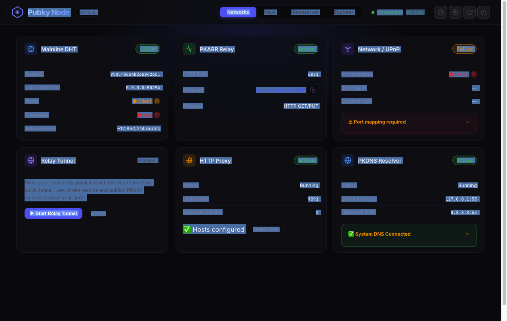
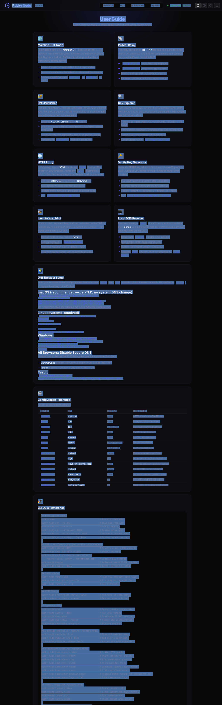

✨🚨100% VIBES🚨✨ - This app was prompted using ai tools and has had no human eyes on the code.

# Pubky Node

> A unified sovereign network participant for the Pubky ecosystem.

Pubky Node bundles the core Pubky infrastructure — a **Mainline DHT node**, a **Pkarr relay**, a **DNS record publisher**, and a **Pkdns local DNS resolver** — into a single binary with a web dashboard, shared configuration, and graceful lifecycle management.

## Screenshots

<p align="center">
  
</p>

<p align="center">
  
  
</p>

## Features

| Feature | Description |
|---------|-------------|
| **DHT Node** | Full Mainline DHT routing and BEP44 record storage (~3M+ peer network) |
| **Pkarr Relay** | HTTP API for publishing and resolving signed DNS packets |
| **DNS Publisher** | Sign DNS records with secret keys and publish to the DHT with retry |
| **Pkdns Resolver** | Local DNS server resolving sovereign `.pkarr` / `.key` domains |
| **Identity Watchlist** | Monitors and republishes Pkarr records to keep identities alive |
| **Key Explorer** | Look up any public key and inspect its DNS records |
| **Web Dashboard** | Live monitoring UI at `http://localhost:9090/` |
| **UPnP Auto-Config** | Automatically opens router ports for full DHT participation |
| **Desktop App** | Native macOS, Windows, and Linux app with system tray |

## Install

### Desktop App (recommended)

Download the installer for your platform from [**Releases**](https://github.com/BitcoinErrorLog/pubky-node/releases):

| Platform | Download |
|----------|----------|
| macOS (Apple Silicon) | `Pubky-Node_x.x.x_aarch64.dmg` |
| macOS (Intel) | `Pubky-Node_x.x.x_x64.dmg` |
| Windows | `Pubky-Node_x.x.x_x64-setup.exe` |
| Linux (Debian/Ubuntu) | `Pubky-Node_x.x.x_amd64.deb` |
| Linux (other) | `Pubky-Node_x.x.x_amd64.AppImage` |

The desktop app runs as a system tray application — close the window to minimize to tray, the node keeps running in the background.

### From Source

```bash
# Build
cargo build --release

# Run with defaults (relay on :6881, dashboard on :9090)
cargo run --release

# Run without DNS (no pkdns binary needed)
cargo run --release -- --no-dns

# Custom ports
cargo run --release -- --relay-port 8080 --dht-port 6882 --dashboard-port 3000

# Verbose logging
cargo run --release -- --verbose
```

Then open **http://localhost:9090/** to access the dashboard.

### Run on Umbrel

Pubky Node is available as a one-click Umbrel app. See the [Umbrel deployment guide](umbrel/README.md) for setup instructions.

### Docker

```bash
# Build the image (from parent directory containing pubky-node, pkarr, pkdns)
docker build -t pubky-node -f pubky-node/Dockerfile .

# Run
docker run -p 9090:9090 -p 6881:6881/tcp -p 6881:6881/udp \
  -v pubky-data:/data \
  pubky-node

# With environment variable overrides
docker run -p 9090:9090 -p 6881:6881/tcp -p 6881:6881/udp \
  -e PUBKY_WATCHLIST_KEYS="key1,key2" \
  -e PUBKY_DNS_ENABLED=false \
  -v pubky-data:/data \
  pubky-node
```

## DNS Browser Setup

Point your browser at the local pkdns resolver to browse `.pkarr` and `.key` domains. pkdns forwards normal DNS queries to `8.8.8.8`, so regular browsing is unaffected.

### macOS (recommended — per-TLD, no system DNS change)

```bash
sudo mkdir -p /etc/resolver
echo "nameserver 127.0.0.1" | sudo tee /etc/resolver/pkarr
echo "nameserver 127.0.0.1" | sudo tee /etc/resolver/key
```

Only sovereign TLDs are routed locally. All other DNS is untouched.

### Linux (systemd-resolved)

```bash
# Create /etc/systemd/resolved.conf.d/pubky.conf
[Resolve]
DNS=127.0.0.1
Domains=~pkarr ~key

# Then restart:
sudo systemctl restart systemd-resolved
```

### Windows

1. Settings → Network & Internet → Wi-Fi/Ethernet
2. Click your connection → DNS server assignment → Edit
3. Set Preferred DNS to: `127.0.0.1`
4. Set Alternate DNS to: `8.8.8.8` (fallback)
5. Save

### Disable Secure DNS in your browser

Browsers with "Secure DNS" (DoH) bypass your local resolver. Disable it:

- **Chrome/Edge**: Settings → Privacy & Security → Use Secure DNS → Off
- **Firefox**: Settings → Privacy → DNS over HTTPS → Off

## Configuration

Create `config.toml` in your data directory (`~/.pubky-node/` by default, or set via `--data-dir`):

```toml
[relay]
http_port = 6881

[dht]
port = 6881

[cache]
size = 1_000_000

[dns]
enabled = true
forward = "8.8.8.8:53"

[watchlist]
enabled = true
keys = [
    "yg4gxe7z1r7mr6orids9fh95y7gxhdsxjqi6nngsxxtakqaxr5no"
]
republish_interval_secs = 3600

[publisher]
enabled = true
interval_secs = 3600
max_retries = 3
retry_delay_secs = 5

[[publisher.keys]]
secret_key = "your_64_hex_char_ed25519_secret_key_here"
# Or load from file (Docker secrets compatible):
# secret_key_file = "/run/secrets/my_key"

[[publisher.keys.records]]
type = "CNAME"
name = "@"
value = "mysite.example.com"
ttl = 3600

[[publisher.keys.records]]
type = "TXT"
name = "_pubky"
value = "v=1"
ttl = 3600
```

### Environment Variables

| Variable | Default | Description |
|----------|---------|-------------|
| `RUST_LOG` | `pubky_node=info,warn` | Log level control |
| `PUBKY_RELAY_PORT` | `6881` | Override relay HTTP port |
| `PUBKY_DHT_PORT` | `6881` | Override DHT UDP port |
| `PUBKY_WATCHLIST_KEYS` | *(empty)* | Comma-separated public keys to watch |
| `PUBKY_DNS_ENABLED` | `true` | Enable/disable DNS resolver |

## Web Dashboard

The dashboard provides a live monitoring UI and tools:

- **Status Overview** — Uptime, DHT network size, watched keys count
- **Mainline DHT** — Node ID, listen address, server/client mode, firewall status, routing table size
- **Pkarr Relay** — HTTP port, endpoint URL, protocol info
- **Network / UPnP** — Port mapping status, external IP, mapped port
- **Identity Watchlist** — Status, republish interval, monitored keys
- **Key Explorer** — Paste any 52-character z-base-32 public key to inspect its DNS records from the DHT
- **User Guide** — Built-in documentation for all features, DNS setup, and config reference

### API Endpoints

| Method | Path | Description |
|--------|------|-------------|
| `GET` | `/api/status` | Node status JSON (uptime, DHT, watchlist, UPnP) |
| `GET` | `/api/resolve/{public_key}` | Resolve a pkarr key and return DNS records |
| `GET` | `/health` | Health check (returns "ok") |

## UPnP Auto-Port-Forwarding

On startup, Pubky Node automatically attempts to configure your router via UPnP to forward UDP port 6881 for full DHT participation. No manual router configuration is needed if your router supports UPnP.

- If UPnP succeeds → **Server mode** (full network participation)
- If UPnP fails → **Client mode** (all features work, just won't store data for others)
- Disable with `--no-upnp`
- Status visible in the dashboard's Network / UPnP card

## Security

- Dashboard binds to **localhost only** by default (`--dashboard-bind` to override)
- Secret keys are **redacted** from all Debug/log output
- Secret key intermediates are **zeroized** in memory after use
- **Security headers** on all responses (CSP, X-Frame-Options, nosniff, Referrer-Policy)
- Watchlist public keys **not exposed** in API (only count)
- **Rate limiting** on `/api/resolve` endpoint
- **DNS config validation** to prevent injection
- **Config file permission warning** on Unix (group/world readable)

## Architecture

```
pubky-node (supervisor)
├── upnp (async, best-effort port mapping)
├── pkarr-relay (HTTP + DHT node)
│   ├── pkarr::Client (SignedPacket publish/resolve)
│   │   └── mainline::Dht (BEP44, routing table)
│   └── axum HTTP server (GET/PUT relay endpoints)
├── publisher (async task)
│   └── sign DNS records + publish to DHT with retry
├── pkdns (subprocess)
│   └── DNS resolver → Pkarr → DHT
├── watchlist (async task)
│   └── periodic resolve + republish via pkarr::Client
└── dashboard (axum HTTP server, port 9090)
    ├── /health — container healthcheck
    ├── /api/status — node monitoring JSON
    ├── /api/resolve/:key — key explorer API
    └── embedded HTML/CSS/JS UI
```

## CLI

Pubky Node includes both a daemon and client subcommands:

```bash
# Run the daemon (default — same as `pubky-node run`)
pubky-node

# Subcommands
pubky-node run [--relay-port 6881] [--no-dns] [--no-upnp]   # daemon mode
pubky-node resolve <PUBLIC_KEY> [--json]                      # look up DNS records
pubky-node publish --secret-key <HEX> --record "A @ 1.2.3.4" # publish to DHT
pubky-node keygen [--json]                                    # generate keypair
pubky-node status [--json] [--url http://localhost:9090]      # query running node
pubky-node dns-setup [--dry-run] [--remove]                   # configure OS DNS
```

### Daemon Options (`pubky-node run`)

```
  -d, --data-dir <PATH>         Data directory [default: ~/.pubky-node]
      --relay-port <PORT>       Override relay HTTP port
      --dht-port <PORT>         Override DHT UDP port
      --dashboard-port <PORT>   Dashboard HTTP port [default: 9090]
      --dashboard-bind <ADDR>   Dashboard bind address [default: 127.0.0.1]
      --no-dns                  Disable the DNS resolver
      --no-upnp                 Disable UPnP auto-port-forwarding
  -v, --verbose                 Enable verbose logging
```

## Development

```bash
# Run tests (42 unit tests)
cargo test

# Run clippy
cargo clippy

# Build desktop app (requires Tauri CLI)
./scripts/build-sidecars.sh
npx @tauri-apps/cli build
```

## Dependencies

| Crate | Version | Role |
|-------|---------|------|
| `pkarr` | 5.0.1 (local) | Signed packet handling, DHT client |
| `pkarr-relay` | 0.11.2 (local) | HTTP relay server |
| `mainline` | 6.0.1 | Mainline DHT engine (via pkarr) |
| `axum` | 0.8 | Dashboard web server |
| `igd-next` | 0.15 | UPnP port mapping |
| `zeroize` | 1 | Secure memory wiping for secret keys |
| `tauri` | 2 | Desktop app framework |

## License

MIT
