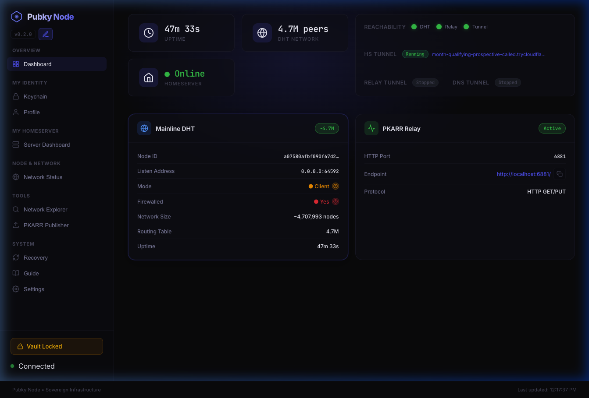
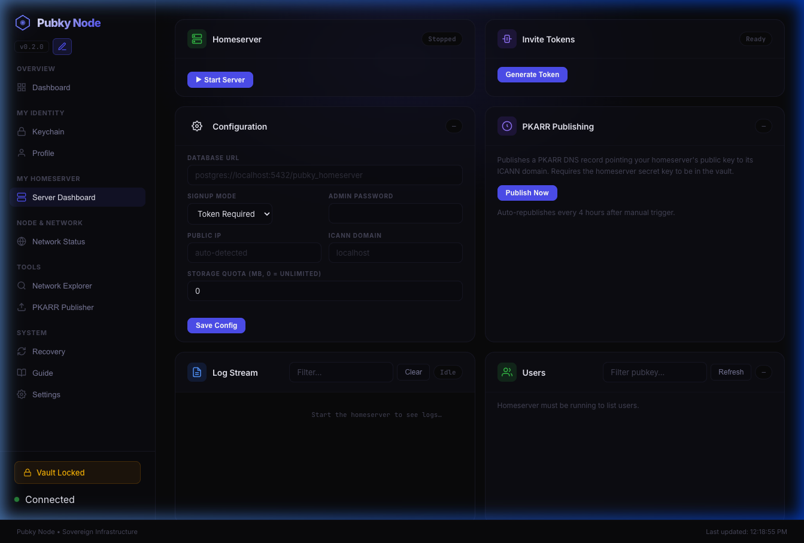
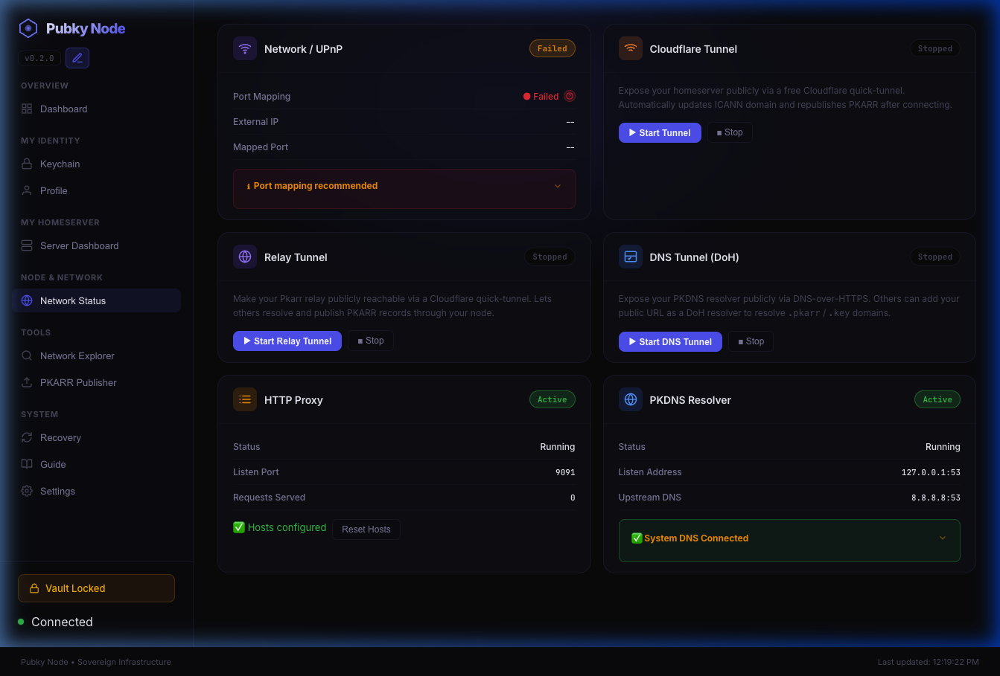
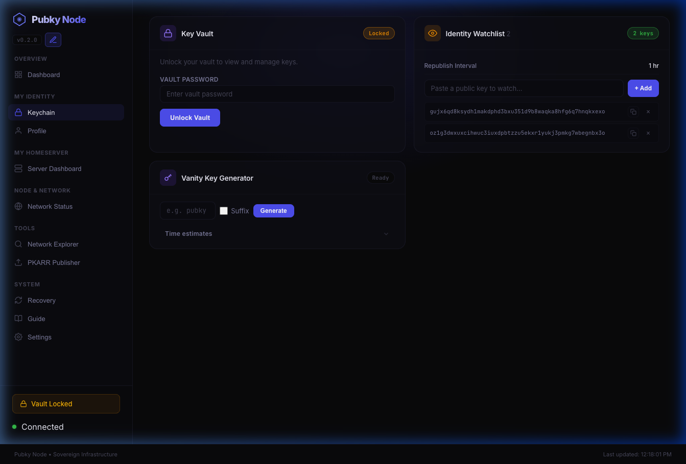
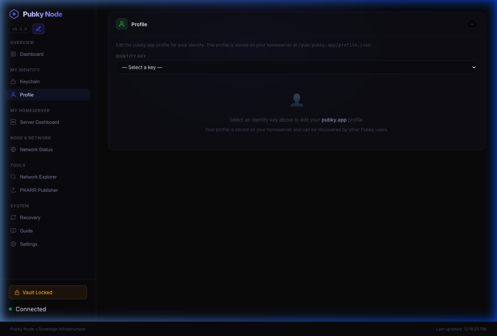
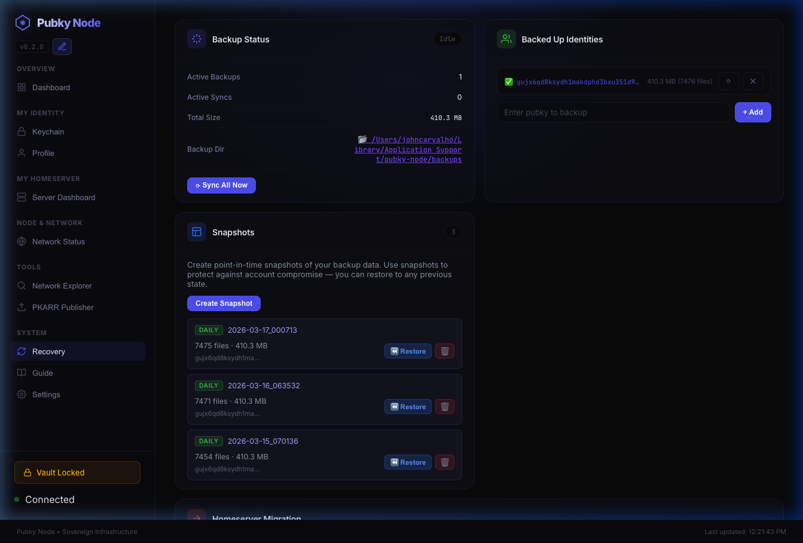
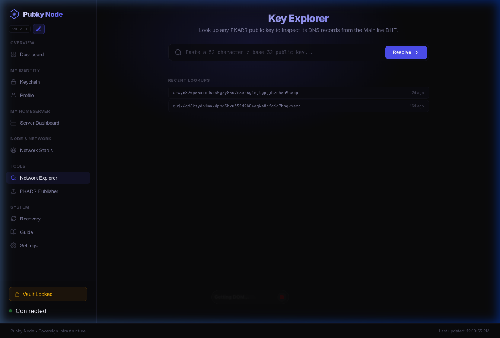

✨🚨100% VIBES🚨✨ - This app was prompted using ai tools and has had no human eyes on the code.

<p align="center">
  
</p>

# Pubky Node

> Run your own sovereign identity and homeserver on the [Pubky](https://pubky.org) network — no DNS, no hosting provider, no middlemen.

Pubky Node is a single binary that bundles everything you need to participate in the Pubky ecosystem: a **Mainline DHT node**, a **Pkarr relay**, a **sovereign DNS resolver**, a **Pubky Homeserver** with embedded PostgreSQL, **Cloudflare Tunnels** for instant public access, and a polished **web dashboard** to manage it all.

## Features

| Feature | Description |
|---------|-------------|
| **Homeserver** | Full Pubky homeserver with embedded PostgreSQL — zero external dependencies |
| **Cloudflare Tunnels** | One-click public exposure via `cloudflared` quick-tunnels (auto-starts with homeserver) |
| **PKARR Publishing** | Automatically publishes DNS records to the DHT so others can discover your homeserver |
| **Key Vault** | Encrypted key storage (argon2id + ChaCha20-Poly1305) with import, export, and backup |
| **Identity Management** | Create identities, edit profiles, sign up on your homeserver, and submit to Nexus |
| **DHT Node** | Full Mainline DHT routing and BEP44 record storage (~5M+ peer network) |
| **Pkarr Relay** | HTTP API (`GET`/`PUT`) for publishing and resolving signed DNS packets |
| **PKDNS Resolver** | Local DNS server that resolves sovereign `.pkarr` / `.key` domains |
| **HTTP Proxy** | Local proxy (port 9091) to browse `.pkarr` profiles in any browser |
| **Identity Watchlist** | Monitors and republishes PKARR records to keep identities alive on the DHT |
| **UPnP Auto-Config** | Automatically opens router ports for full DHT participation |
| **Backup & Recovery** | Automatic backup sync from remote homeservers, snapshot management |
| **Desktop App** | Native macOS app with system tray (Windows/Linux planned) |

## Screenshots

<p align="center">
  
  
</p>

<p align="center">
  
  
</p>

<p align="center">
  
  
</p>

## Install

### Desktop App (recommended)

Download the installer for your platform from [**Releases**](https://github.com/BitcoinErrorLog/pubky-node/releases):

| Platform | Download |
|----------|----------|
| macOS (Apple Silicon) | `Pubky-Node_x.x.x_aarch64.dmg` |
| macOS (Intel) | `Pubky-Node_x.x.x_x64.dmg` |
| Windows | `Pubky-Node_x.x.x_x64-setup.exe` |
| Linux (Debian/Ubuntu) | `Pubky-Node_x.x.x_amd64.deb` |
| Linux (other) | `Pubky-Node_x.x.x_amd64.AppImage` |

The desktop app runs as a system tray application — close the window to minimize to tray, the node keeps running in the background.

### From Source

```bash
cargo build --release
cargo run --release

# Without DNS resolver (no pkdns binary needed)
cargo run --release -- --no-dns

# Custom ports
cargo run --release -- --relay-port 8080 --dht-port 6882 --dashboard-port 3000
```

Then open **http://localhost:9090/** in your browser.

### Docker

```bash
docker build -t pubky-node -f pubky-node/Dockerfile .

docker run -p 9090:9090 -p 6881:6881/tcp -p 6881:6881/udp \
  -v pubky-data:/data \
  pubky-node
```

### Umbrel

Pubky Node is available as a one-click Umbrel app. See the [Umbrel deployment guide](umbrel/README.md).

## Dashboard Pages

The web dashboard at `http://localhost:9090/` provides a full management interface:

| Page | Description |
|------|-------------|
| **Dashboard** | Overview — uptime, peer count, homeserver status, tunnel status, DHT and relay details |
| **Keychain** | Key vault (add, import, export, delete keys), identity watchlist, vanity key generator |
| **Profile** | Edit your pubky.app profile (name, bio, status, links), verify reachability, submit to Nexus |
| **Server Dashboard** | Homeserver control (start/stop), configuration editor, invite tokens, PKARR publishing, log stream, user list |
| **Network Status** | UPnP port mapping, Cloudflare tunnels (homeserver/relay/DNS), HTTP proxy, PKDNS resolver |
| **Network Explorer** | Resolve any public key's DHT records |
| **PKARR Publisher** | Manually publish DNS records to the DHT with a vault key |
| **Recovery** | Backup sync status, identity snapshots, and recovery tools |
| **Guide** | Built-in documentation and setup instructions |
| **Settings** | Dashboard password, data directory, node restart/shutdown |

## How It Works

When you launch Pubky Node, it automatically:

1. **Starts a DHT node** — joins the ~5M peer Mainline DHT network
2. **Starts the Pkarr relay** — HTTP API for DNS packet resolution
3. **Starts embedded PostgreSQL** — zero-config database for the homeserver
4. **Starts the homeserver** — your personal Pubky data store
5. **Starts a Cloudflare tunnel** — instant public URL, no port forwarding needed
6. **Publishes your PKARR record** — so the network can find your homeserver
7. **Starts PKDNS** — local DNS resolver for `.pkarr` / `.key` domains
8. **Starts the HTTP proxy** — browse sovereign domains in any browser

Everything is automatic. Open the dashboard, unlock the vault, and you're live on the Pubky network.

## DNS Browser Setup

Point your browser at the local PKDNS resolver to browse `.pkarr` and `.key` domains. Normal DNS queries are forwarded to `8.8.8.8`, so regular browsing is unaffected.

### macOS (recommended — per-TLD, no system DNS change)

```bash
sudo mkdir -p /etc/resolver
echo "nameserver 127.0.0.1" | sudo tee /etc/resolver/pkarr
echo "nameserver 127.0.0.1" | sudo tee /etc/resolver/key
```

### Linux (systemd-resolved)

```bash
# /etc/systemd/resolved.conf.d/pubky.conf
[Resolve]
DNS=127.0.0.1
Domains=~pkarr ~key

sudo systemctl restart systemd-resolved
```

### Windows

1. Settings → Network & Internet → Wi-Fi/Ethernet
2. Click your connection → DNS server assignment → Edit
3. Set Preferred DNS to `127.0.0.1`, Alternate to `8.8.8.8`
4. Save

### Disable Secure DNS in your browser

Browsers with "Secure DNS" (DoH) bypass local resolvers:

- **Chrome/Edge**: Settings → Privacy & Security → Use Secure DNS → Off
- **Firefox**: Settings → Privacy → DNS over HTTPS → Off

## Configuration

The dashboard manages all configuration through the UI. For advanced use, create `config.toml` in your data directory:

```toml
[relay]
http_port = 6881

[dht]
port = 6881

[dns]
enabled = true
forward = "8.8.8.8:53"

[watchlist]
enabled = true
keys = ["yg4gxe7z1r7mr6orids9fh95y7gxhdsxjqi6nngsxxtakqaxr5no"]
republish_interval_secs = 3600
```

**Data directory**: `~/Library/Application Support/pubky-node/` (macOS) or `~/.pubky-node/` (Linux). Override with `--data-dir`.

## CLI

Pubky Node includes a full CLI alongside the dashboard:

```bash
# Daemon
pubky-node run [--relay-port 6881] [--no-dns] [--no-upnp]

# Standalone tools
pubky-node resolve <KEY> [--json]
pubky-node publish --secret-key <HEX> --record "A @ 1.2.3.4"
pubky-node keygen [--json]
pubky-node vanity <PREFIX> [--suffix] [--threads N]

# Homeserver
pubky-node homeserver status|start|stop|check|users|token|publish-pkarr|logs

# Tunnel
pubky-node tunnel status|start|stop|check

# Watchlist
pubky-node watchlist list|add|remove <KEY>

# Node control
pubky-node node restart|shutdown
```

## Architecture

```
pubky-node (supervisor)
├── pkarr-relay (HTTP + DHT node)
│   ├── pkarr::Client (SignedPacket publish/resolve)
│   └── mainline::Dht (BEP44 routing table, ~5M peers)
├── homeserver (subprocess)
│   ├── embedded PostgreSQL (auto-managed, port 5433)
│   └── PKARR key republisher
├── tunnel-manager (cloudflared subprocesses)
│   ├── homeserver tunnel (auto-start, PKARR auto-publish)
│   ├── relay tunnel
│   └── DNS tunnel (DoH)
├── key-vault (encrypted: argon2id + ChaCha20-Poly1305)
├── watchlist (periodic DHT republisher)
├── pkdns (subprocess: .pkarr/.key DNS resolver)
├── http-proxy (port 9091)
├── upnp (async port mapping)
├── backup (periodic remote homeserver sync)
└── dashboard (port 9090)
    ├── embedded HTML/CSS/JS (no build step)
    ├── /api/* endpoints (auth-protected)
    └── password-protected web UI
```

## Security

- Dashboard binds to **localhost only** by default
- All API endpoints require **password authentication**
- Key vault uses **argon2id** key derivation + **ChaCha20-Poly1305** AEAD encryption
- Secret keys are **zeroized** in memory after use
- **Security headers** on all responses (CSP, X-Frame-Options, nosniff)
- **Rate limiting** on resolve endpoints

## Development

```bash
cargo test                              # run tests
cargo clippy                            # lint check

# Desktop app build
bash scripts/build-sidecars.sh --release  # compile sidecars
cargo tauri build                         # build .dmg / .exe / .deb
```

## License

MIT
