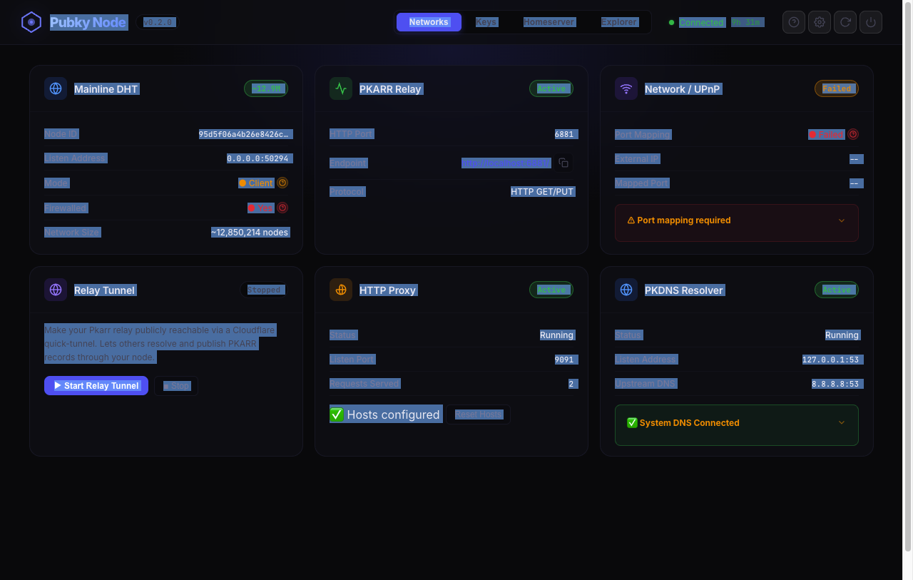
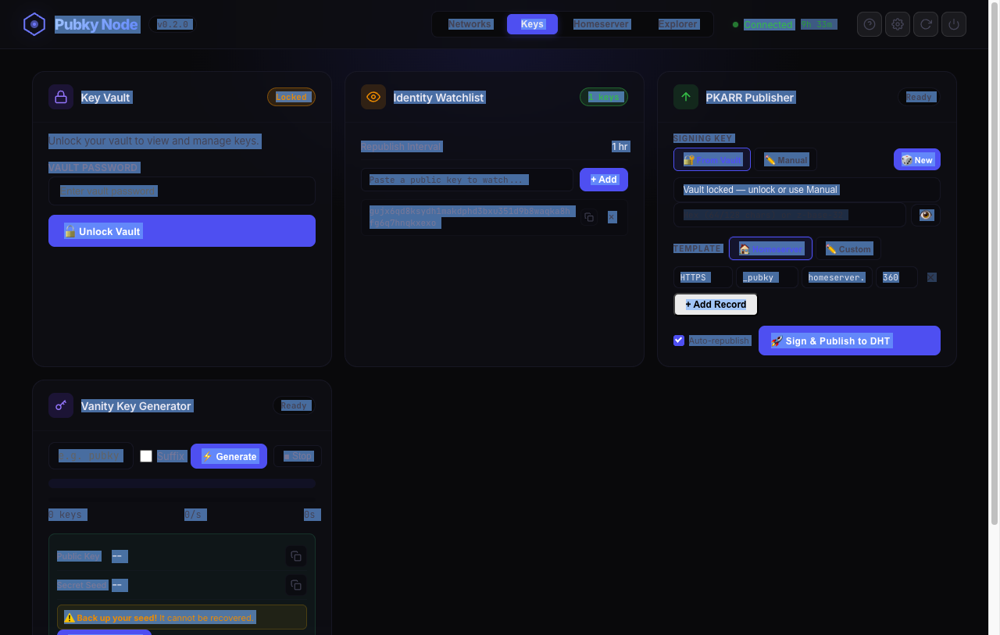
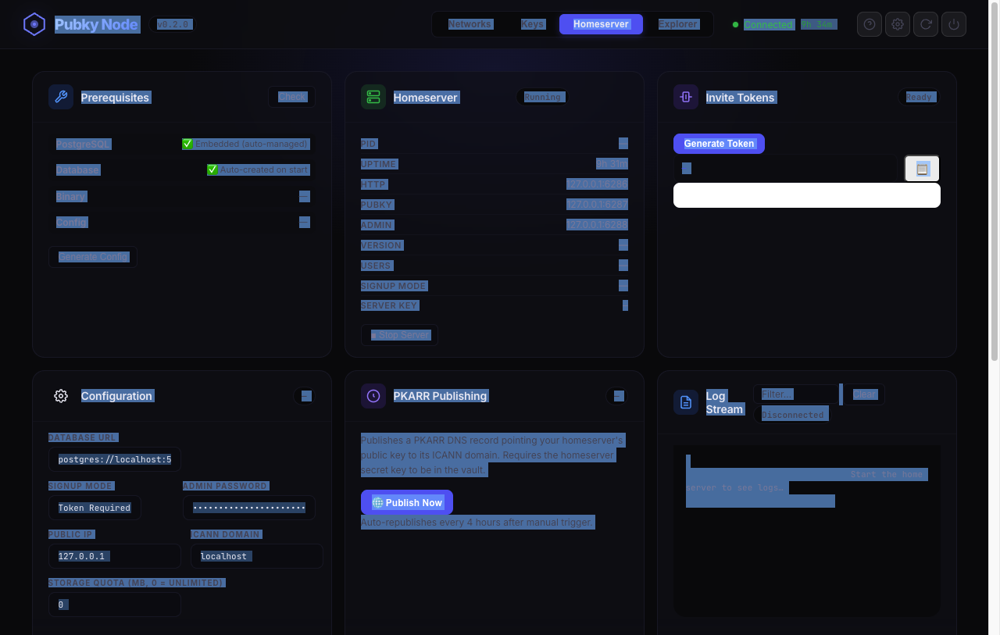
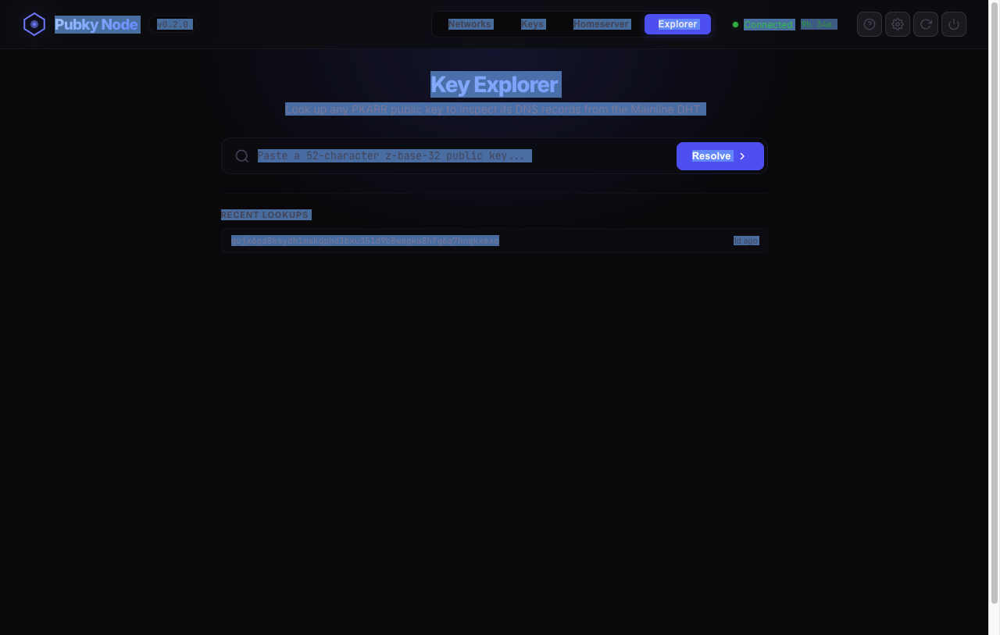
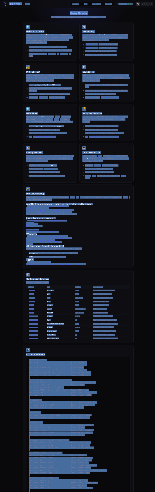

✨🚨100% VIBES🚨✨ - This app was prompted using ai tools and has had no human eyes on the code.

# Pubky Node

> A unified sovereign network participant for the Pubky ecosystem.

Pubky Node bundles the core Pubky infrastructure — a **Mainline DHT node**, a **Pkarr relay**, a **DNS record publisher**, a **Pkdns local DNS resolver**, and a built-in **Homeserver** — into a single binary with a web dashboard, shared configuration, and graceful lifecycle management.

## Screenshots

<p align="center">
  
</p>

<p align="center">
  
  
</p>

<p align="center">
  
  
</p>

## Features

| Feature | Description |
|---------|-------------|
| **DHT Node** | Full Mainline DHT routing and BEP44 record storage (~3M+ peer network) |
| **Pkarr Relay** | HTTP API for publishing and resolving signed DNS packets |
| **DNS Publisher** | Sign DNS records with secret keys and publish to the DHT with retry |
| **Pkdns Resolver** | Local DNS server resolving sovereign `.pkarr` / `.key` domains |
| **HTTP Proxy** | Local proxy (port 9091) to browse `.pkarr` profiles in any browser |
| **Identity Watchlist** | Monitors and republishes Pkarr records to keep identities alive |
| **Vanity Key Generator** | Multi-threaded brute-force z-base-32 prefix/suffix key grinder |
| **Key Explorer** | Look up any public key and inspect its DNS records |
| **Key Vault** | Encrypted key storage (argon2id + ChaCha20-Poly1305) with import/export and Pubky Ring QR codes |
| **Homeserver** | Built-in Pubky homeserver with embedded PostgreSQL, user management, and admin API |
| **Embedded PostgreSQL** | Zero-dependency database bundled at compile time — auto-extracts on first run |
| **Identity Manager** | Sign up vault keys on local homeserver using EdDSA AuthToken protocol |
| **Cloudflare Tunnels** | Zero-config internet exposure via `cloudflared` quick-tunnels (homeserver + relay) |
| **Web Dashboard** | Live monitoring UI at `http://localhost:9090/` with 5 tabs |
| **UPnP Auto-Config** | Automatically opens router ports for full DHT participation |
| **Desktop App** | Native macOS, Windows, and Linux app with system tray |

## Install

### Desktop App (recommended)

Download the installer for your platform from [**Releases**](https://github.com/BitcoinErrorLog/pubky-node/releases):

| Platform | Download |
|----------|----------|
| macOS (Apple Silicon) | `Pubky-Node_x.x.x_aarch64.dmg` |
| macOS (Intel) | `Pubky-Node_x.x.x_x64.dmg` |
| Windows | `Pubky-Node_x.x.x_x64-setup.exe` |
| Linux (Debian/Ubuntu) | `Pubky-Node_x.x.x_amd64.deb` |
| Linux (other) | `Pubky-Node_x.x.x_amd64.AppImage` |

The desktop app runs as a system tray application — close the window to minimize to tray, the node keeps running in the background.

### From Source

```bash
# Build
cargo build --release

# Run with defaults (relay on :6881, dashboard on :9090)
cargo run --release

# Run without DNS (no pkdns binary needed)
cargo run --release -- --no-dns

# Custom ports
cargo run --release -- --relay-port 8080 --dht-port 6882 --dashboard-port 3000

# Verbose logging
cargo run --release -- --verbose
```

Then open **http://localhost:9090/** to access the dashboard.

### Run on Umbrel

Pubky Node is available as a one-click Umbrel app. See the [Umbrel deployment guide](umbrel/README.md) for setup instructions.

### Docker

```bash
# Build the image (from parent directory containing pubky-node, pkarr, pkdns)
docker build -t pubky-node -f pubky-node/Dockerfile .

# Run
docker run -p 9090:9090 -p 6881:6881/tcp -p 6881:6881/udp \
  -v pubky-data:/data \
  pubky-node

# With environment variable overrides
docker run -p 9090:9090 -p 6881:6881/tcp -p 6881:6881/udp \
  -e PUBKY_WATCHLIST_KEYS="key1,key2" \
  -e PUBKY_DNS_ENABLED=false \
  -v pubky-data:/data \
  pubky-node
```

## DNS Browser Setup

Point your browser at the local pkdns resolver to browse `.pkarr` and `.key` domains. pkdns forwards normal DNS queries to `8.8.8.8`, so regular browsing is unaffected.

### macOS (recommended — per-TLD, no system DNS change)

```bash
sudo mkdir -p /etc/resolver
echo "nameserver 127.0.0.1" | sudo tee /etc/resolver/pkarr
echo "nameserver 127.0.0.1" | sudo tee /etc/resolver/key
```

Only sovereign TLDs are routed locally. All other DNS is untouched.

### Linux (systemd-resolved)

```bash
# Create /etc/systemd/resolved.conf.d/pubky.conf
[Resolve]
DNS=127.0.0.1
Domains=~pkarr ~key

# Then restart:
sudo systemctl restart systemd-resolved
```

### Windows

1. Settings → Network & Internet → Wi-Fi/Ethernet
2. Click your connection → DNS server assignment → Edit
3. Set Preferred DNS to: `127.0.0.1`
4. Set Alternate DNS to: `8.8.8.8` (fallback)
5. Save

### Disable Secure DNS in your browser

Browsers with "Secure DNS" (DoH) bypass your local resolver. Disable it:

- **Chrome/Edge**: Settings → Privacy & Security → Use Secure DNS → Off
- **Firefox**: Settings → Privacy → DNS over HTTPS → Off

## Configuration

Create `config.toml` in your data directory (`~/.pubky-node/` by default, or set via `--data-dir`):

```toml
[relay]
http_port = 6881

[dht]
port = 6881

[cache]
size = 1_000_000

[dns]
enabled = true
forward = "8.8.8.8:53"

[watchlist]
enabled = true
keys = [
    "yg4gxe7z1r7mr6orids9fh95y7gxhdsxjqi6nngsxxtakqaxr5no"
]
republish_interval_secs = 3600

[publisher]
enabled = true
interval_secs = 3600
max_retries = 3
retry_delay_secs = 5

[[publisher.keys]]
secret_key = "your_64_hex_char_ed25519_secret_key_here"
# Or load from file (Docker secrets compatible):
# secret_key_file = "/run/secrets/my_key"

[[publisher.keys.records]]
type = "CNAME"
name = "@"
value = "mysite.example.com"
ttl = 3600

[[publisher.keys.records]]
type = "TXT"
name = "_pubky"
value = "v=1"
ttl = 3600
```

### Environment Variables

| Variable | Default | Description |
|----------|---------|-------------|
| `RUST_LOG` | `pubky_node=info,warn` | Log level control |
| `PUBKY_RELAY_PORT` | `6881` | Override relay HTTP port |
| `PUBKY_DHT_PORT` | `6881` | Override DHT UDP port |
| `PUBKY_WATCHLIST_KEYS` | *(empty)* | Comma-separated public keys to watch |
| `PUBKY_DNS_ENABLED` | `true` | Enable/disable DNS resolver |

## Web Dashboard

The dashboard provides a live monitoring UI and tools across five tabs:

- **Networks** — DHT node stats, Pkarr relay info, UPnP status, PKDNS resolver, HTTP proxy, and Cloudflare tunnels (homeserver + relay)
- **Keys** — Key vault (encrypted storage with import/export/QR), PKARR publisher, identity watchlist, and vanity key generator
- **Homeserver** — Prerequisites check, server control (start/stop with SSE logs), user management, invite tokens, config editor, identity signup, and PKARR publishing
- **Explorer** — Paste any 52-character z-base-32 public key to look up its DHT DNS records

The **Guide** (📖) and **Settings** (⚙) buttons are in the top-right corner of the header.

### API Endpoints

| Method | Path | Description |
|--------|------|-------------|
| `GET` | `/api/status` | Node status JSON (uptime, DHT, watchlist, UPnP, DNS, proxy) |
| `GET` | `/api/resolve/{public_key}` | Resolve a pkarr key and return DNS records |
| `POST` | `/api/publish` | Sign and publish DNS records to the DHT |
| `GET` | `/health` | Health check (returns "ok") |
| | | |
| `POST` | `/api/vault/create` | Create a new encrypted vault |
| `POST` | `/api/vault/unlock` | Unlock the vault with password |
| `POST` | `/api/vault/lock` | Lock the vault |
| `GET` | `/api/vault/keys` | List keys in the vault |
| `POST` | `/api/vault/keys` | Add a key to the vault |
| `DELETE` | `/api/vault/keys/{pubkey}` | Delete a key from the vault |
| `POST` | `/api/vault/keys/{pubkey}/rename` | Rename a vault key |
| `GET` | `/api/vault/keys/{pubkey}/export` | Export a key's secret |
| `GET` | `/api/vault/export-all` | Export all keys (backup) |
| `POST` | `/api/vault/import` | Import keys from backup |
| | | |
| `POST` | `/api/identity/signup` | Sign up a vault key on homeserver |
| `POST` | `/api/identity/signin` | Sign in with existing keypair |
| `GET` | `/api/identity/list` | List registered identities |
| | | |
| `POST` | `/api/watchlist` | Add a key to the identity watchlist |
| `DELETE` | `/api/watchlist/{key}` | Remove a key from the watchlist |
| `GET` | `/api/watchlist` | List watchlist keys |
| | | |
| `GET` | `/api/tunnel/status` | Homeserver tunnel state + URL |
| `POST` | `/api/tunnel/start` | Start homeserver quick-tunnel |
| `POST` | `/api/tunnel/stop` | Stop homeserver quick-tunnel |
| `GET` | `/api/tunnel/check` | Check cloudflared binary |
| `GET` | `/api/relay-tunnel/status` | Relay tunnel state + URL |
| `POST` | `/api/relay-tunnel/start` | Start relay quick-tunnel |
| `POST` | `/api/relay-tunnel/stop` | Stop relay quick-tunnel |
| | | |
| `GET` | `/api/homeserver/status` | Homeserver state, PID, ports |
| `POST` | `/api/homeserver/start` | Start homeserver process |
| `POST` | `/api/homeserver/stop` | Stop homeserver process |
| `GET` | `/api/homeserver/check` | Prerequisites check |
| `POST` | `/api/homeserver/fix` | Auto-fix prerequisites |
| `GET` | `/api/homeserver/config` | Read homeserver config |
| `POST` | `/api/homeserver/config` | Write homeserver config |
| `GET` | `/api/homeserver/users` | List homeserver users |
| `POST` | `/api/homeserver/token` | Generate signup invite token |
| `POST` | `/api/homeserver/publish-pkarr` | Publish PKARR record |
| `GET` | `/api/logs/stream` | SSE stream of homeserver stdout |
| | | |
| `POST` | `/api/keys/vanity/start` | Start vanity key generation |
| `GET` | `/api/keys/vanity/status` | Poll vanity grinder status |
| `POST` | `/api/keys/vanity/stop` | Stop vanity key generation |
| `POST` | `/api/dns/toggle` | Toggle PKDNS enabled/disabled |
| `POST` | `/api/dns/set-system` | Set macOS system DNS to local |
| `POST` | `/api/dns/reset-system` | Reset macOS system DNS |
| `POST` | `/api/proxy/setup-hosts` | Configure /etc/hosts for proxy |
| `POST` | `/api/proxy/reset-hosts` | Remove proxy entries from /etc/hosts |
| `GET` | `/api/proxy/hosts-status` | Check if /etc/hosts is configured |
| `POST` | `/api/shutdown` | Shutdown the node process |
| `POST` | `/api/restart` | Restart the node process |

## UPnP Auto-Port-Forwarding

On startup, Pubky Node automatically attempts to configure your router via UPnP to forward UDP port 6881 for full DHT participation. No manual router configuration is needed if your router supports UPnP.

- If UPnP succeeds → **Server mode** (full network participation)
- If UPnP fails → **Client mode** (all features work, just won't store data for others)
- Disable with `--no-upnp`
- Status visible in the dashboard's Networks tab

## Security

- Dashboard binds to **localhost only** by default (`--dashboard-bind` to override)
- Secret keys are **redacted** from all Debug/log output
- Secret key intermediates are **zeroized** in memory after use
- **Security headers** on all responses (CSP, X-Frame-Options, nosniff, Referrer-Policy)
- Watchlist public keys **not exposed** in API (only count)
- **Rate limiting** on `/api/resolve` endpoint
- **DNS config validation** to prevent injection
- **Config file permission warning** on Unix (group/world readable)

## Architecture

```
pubky-node (supervisor)
├── upnp (async, best-effort port mapping)
├── pkarr-relay (HTTP + DHT node)
│   ├── pkarr::Client (SignedPacket publish/resolve)
│   │   └── mainline::Dht (BEP44, routing table)
│   └── axum HTTP server (GET/PUT relay endpoints)
├── publisher (async task)
│   └── sign DNS records + publish to DHT with retry
├── pkdns (subprocess)
│   └── DNS resolver → Pkarr → DHT
├── watchlist (async task)
│   └── periodic resolve + republish via pkarr::Client
├── homeserver (subprocess / managed process)
│   ├── embedded PostgreSQL (port 5433, auto-managed)
│   ├── admin API proxy (users, tokens, config)
│   └── PKARR record auto-publisher
├── key-vault (encrypted file: keyvault.enc)
│   └── argon2id + ChaCha20-Poly1305 AEAD
├── identity-manager
│   └── EdDSA AuthToken signup/signin on homeserver
├── tunnel-manager (cloudflared subprocesses)
│   ├── homeserver tunnel (ICANN endpoint)
│   └── relay tunnel (Pkarr HTTP API)
├── http-proxy (axum, port 9091)
│   └── .pkarr/.key/.pubky profile rendering
└── dashboard (axum HTTP server, port 9090)
    ├── /health — container healthcheck
    ├── /api/status — node monitoring JSON
    ├── /api/resolve/:key — key explorer
    ├── /api/vault/* — encrypted key management
    ├── /api/identity/* — signup/signin
    ├── /api/homeserver/* — process control + admin
    ├── /api/tunnel/* — cloudflare tunnels
    ├── /api/keys/vanity/* — vanity key grinder
    ├── /api/proxy/* — /etc/hosts management
    └── embedded HTML/CSS/JS UI
```

## CLI

Pubky Node includes both a daemon and client subcommands. Subcommands that communicate with a running node use `--url` (default: `http://localhost:9090`) to specify the dashboard address.

```bash
# Run the daemon (default — same as `pubky-node run`)
pubky-node

# === Daemon ===
pubky-node run [--relay-port 6881] [--no-dns] [--no-upnp]       # daemon mode

# === Standalone tools (no running node needed) ===
pubky-node resolve <PUBLIC_KEY> [--json]                          # look up DNS records
pubky-node publish --secret-key <HEX> --record "A @ 1.2.3.4"    # publish to DHT
pubky-node keygen [--json]                                        # generate keypair
pubky-node vanity <PREFIX> [--suffix] [--threads N] [--json]     # vanity key grinder
pubky-node dns-setup [--dry-run] [--remove]                      # configure OS DNS
pubky-node proxy-hosts <KEY1> [KEY2 ...] [--reset]               # /etc/hosts for proxy

# === Running-node operations (requires node to be running) ===
pubky-node status [--json] [--url ...]                            # node status

# Watchlist
pubky-node watchlist list [--json]                                # list watched keys
pubky-node watchlist add <KEY>                                    # add key to watchlist
pubky-node watchlist remove <KEY>                                 # remove key from watchlist

# Homeserver
pubky-node homeserver status [--json]                             # homeserver state + ports
pubky-node homeserver start                                       # start homeserver process
pubky-node homeserver stop                                        # stop homeserver process
pubky-node homeserver check [--json]                              # prerequisites check
pubky-node homeserver token [--json]                              # generate signup invite token
pubky-node homeserver users [--json]                              # list registered users
pubky-node homeserver publish-pkarr                               # publish homeserver PKARR record
pubky-node homeserver logs [-n 50]                                # tail homeserver logs

# Tunnel (Cloudflare quick-tunnel)
pubky-node tunnel status [--json]                                 # tunnel state + URL
pubky-node tunnel start                                           # start quick-tunnel
pubky-node tunnel stop                                            # stop quick-tunnel
pubky-node tunnel check                                           # check cloudflared binary

# Node control
pubky-node node restart                                           # restart the node
pubky-node node shutdown                                          # graceful shutdown
```

### Daemon Options (`pubky-node run`)

```
  -d, --data-dir <PATH>         Data directory [default: ~/.pubky-node]
      --relay-port <PORT>       Override relay HTTP port
      --dht-port <PORT>         Override DHT UDP port
      --dashboard-port <PORT>   Dashboard HTTP port [default: 9090]
      --dashboard-bind <ADDR>   Dashboard bind address [default: 127.0.0.1]
      --no-dns                  Disable the DNS resolver
      --no-upnp                 Disable UPnP auto-port-forwarding
  -v, --verbose                 Enable verbose logging
```

## Development

```bash
# Run tests
cargo test

# Run clippy
cargo clippy

# Build desktop app (requires Tauri CLI)
./scripts/build-sidecars.sh
npx @tauri-apps/cli build
```

## Dependencies

| Crate | Version | Role |
|-------|---------|------|
| `pkarr` | 5.0.1 (local) | Signed packet handling, DHT client |
| `pkarr-relay` | 0.11.2 (local) | HTTP relay server |
| `mainline` | 6.0.1 | Mainline DHT engine (via pkarr) |
| `axum` | 0.8 | Dashboard web server |
| `igd-next` | 0.15 | UPnP port mapping |
| `zeroize` | 1 | Secure memory wiping for secret keys |
| `tauri` | 2 | Desktop app framework |

## License

MIT
